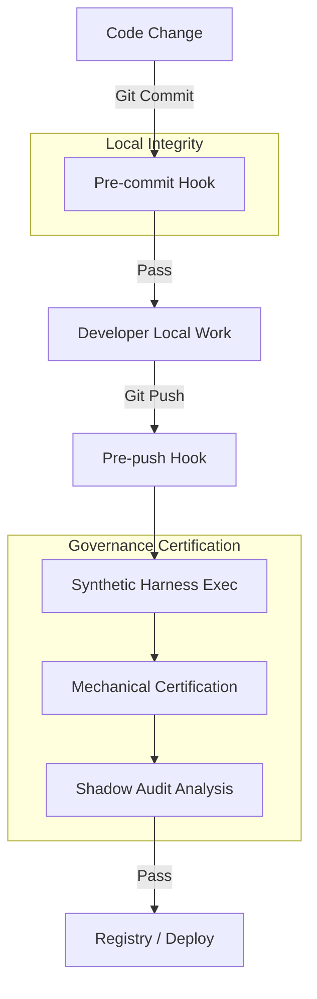

# OEAR CI/CD Pipeline & Certification Workflow

This document outlines the mechanical gates and validation steps required for OEAR Sovereign Control Plane deployment.

## 1. Flow Overview

## 2. Phase 1: Pre-commit (Equivalence Check)
- **Tool**: `scripts/run_oear_cert.sh`
- **Actions**:
    - Executes `run_demo.py` (Functional scenarios).
    - Checks temporal monotonicity in `oear_journal.jsonl`.
    - Verifies correlation between `Metrics` and `Journal`.
- **Invariants**: 
    - `ts[i] <= ts[i+1]`
    - `commit_ok` matches `Metrics OK`.

## 3. Phase 2: Pre-push (Harness Certification)
- **Tool**: `scripts/run_oear_push_cert.sh`
- **Actions**:
    - Executes `run_synthetic_harness.py` with the 23-vector baseline (v1).
    - Verifies the cryptographic hash of the baseline vector set.
    - Validates Gate C block counts and unique run identifiers.
- **Fail Condition**: Any mismatch between expected gate/verdict and observed audit rastro blocks the push.

## 4. Phase 3: Shadow Governance (Parallel Audit)
- **Component**: `ShadowAuditor`
- **Operation**:
    - Runs in parallel to the main control plane.
    - Uses stricter thresholds (current v2-strict).
    - Records mismatches in `oear_shadow_journal.jsonl`.
- **Purpose**: Detect sessions that pass current governance (v1) but would be blocked by future/stricter policies (v2). This provides the "drift delta" for the next threshold update.

## 5. Phase 4: Longitudinal Telemetry
- **Tool**: `telemetry_dashboard.py`
- **Output**:
    - Generates a per-commit dashboard.
    - Tracks `hard_block_rate`, `soft_fail_rate`, and `drift` per vector family.
    - Emits `[DIAGNOSIS]` alerts for Grip Weakening (Drift > 0.5) or Invariant Erosion (Drift > 0.0).

## 6. Certification Metadata
| Step | Artifact | Integrity Check |
|---|---|---|
| Traceability | `oear_journal.jsonl` | Append-only / SHA-256 |
| Metrics | `oear_metrics.jsonl` | Per-run ID / Drift captured |
| Shadow | `oear_shadow_journal.jsonl` | Mismatch counting (OK vs SHADOW_BLOCK) |
| Baseline | `oear_gate_cert_vectors_v1.json` | Cripto-congelado (SHA-256) |
